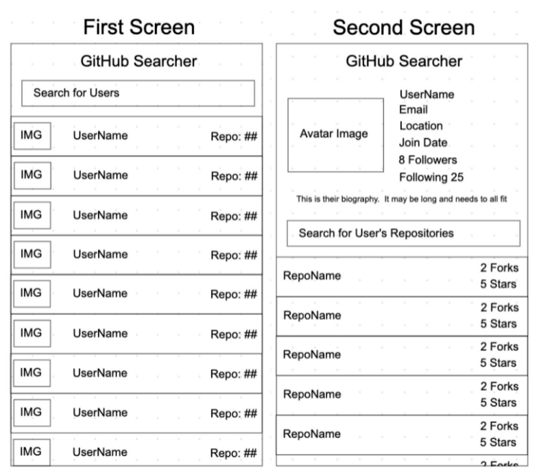

## React Test Task

Please build a web application that is able to search through GitHub users and their corresponding projects using the GitHub api: https://docs.github.com/en/rest using React. The application shall contain 2 screens.

The first screen will contain a search bar that can search through any user on the GitHub website at the top with a list of results underneath. Each item should contain the avatar image, username, and the number of repositories they have. The list view shall not be paginated.

Tapping on a user will bring up a screen that contains the profile details of that user. The view should contain their avatar image, username, number of followers, number of following, biography, email, location, join date, and a list of public repositories with a search bar at the top. Each item of the list view shall contain the name of the repository, the number of stars, and the Number of forks. The search bar will allow the user to search through the user’s repository. The list view shall not be paginated. Additionally, the search will automatically update upon each letter entered.

Tapping on a repository shall bring the user to a web browser and open the repository in the GitHub website.

You shall be given 24 hours to complete this task.

The application will be used during the interview, please be ready to explain and defend your choices for technologies and coding paradigms.

All results should be cached such that when going back, the results should still be displayed on the previous screen.

The application shall be hosted on your own GitHub.

Please make sure that the application 100% works before submitting it.

Preferable tech stack - TypeScript, SCSS

